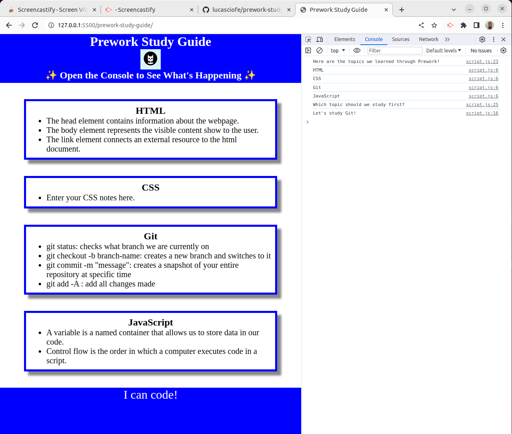

# Prework Webpage

## Description 
This Study Guide was created for boot camp students who were going through the Prework activities. It contains
notes on HTML, CSS, Git, and JavaScript.

## Installation
N/A

## Usage

To use this Study Guide, you can review the notes in each section. For suggestions on what to study first,
you can open Dev console by pressing `Command+Option+I` (MacOS) and `Control+Shift+I(Windows)` or `F12`. 
A console panel should open either below or to the side of the webpage in the browser. There you will
see a list of topics we learned from Prework along with a suggestion on which topic to study first.

## Credits
N/A

## License 
Mit license.
